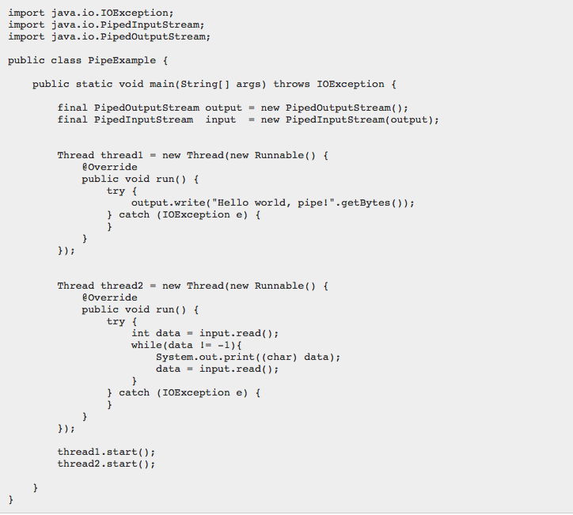

# 管道
- Java IO中的管道为运行在同一个JVM中的两个线程提供了通信的能力。所以管道也可以作为数据源以及目标媒介。
 你不能利用管道与不同的JVM中的线程通信(__不同的进程__)。
 在Java中，通信的双方应该是运行在同一进程中的不同线程。

## 示例

注：本例忽略了流的关闭。请在处理流的过程中，务必保证关闭流

## 注意点
- 不能再同一线程中进行读写（相关的流）
 当使用两个相关联的管道流时，务必将它们分配给不同的线程。read()方法和write()方法调用时会导致流阻塞，这意味着如果你尝试在一个线程中同时进行读和写，可能会导致线程死锁。