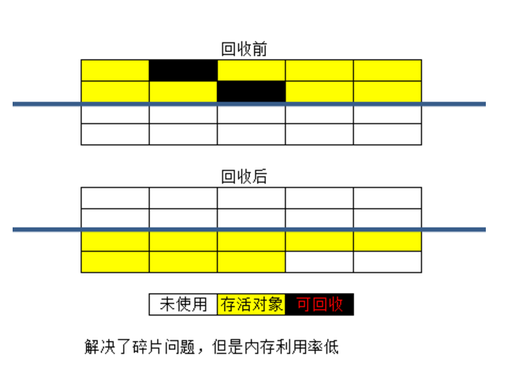
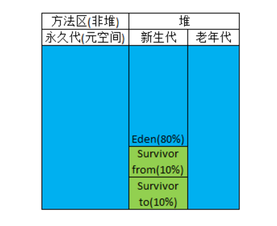

# 垃圾收集算法
## 标记-清除算法
首先标记处所需要回收的对象，在标记完成后统一回收所有被标记的对象。

一个效率问题，标记和清除过程都效率不高；一个是空间问题，标记清除之后会产生大量不连续的内存碎片
## 复制算法
他将可用内存按容量划分为大小相等的两块，每次只需要使用其中一块。当一块内存用完了，将还存活的对象复制到另一块上面，然后再把刚刚用完的内存空间一次清理掉。这样就解决了内存碎片问题，但是代价就是可以用内容就缩小为原来的一半。

## 标记-整理算法
复制算法在对象存活率较高时就会进行频繁的复制操作，效率将降低。因此又有了标记-整理算法，标记过程同标记-清除算法，但是在后续步骤不是直接对对象进行清理，而是让所有存活的对象都向一侧移动，然后直接清理掉端边界以外的内存。

## 分代收集算法
新产生的对象优先进去Eden区，当Eden区满了之后再使用Survivor from，当Survivor from 也满了之后就进行Minor GC（新生代GC），将Eden和Survivor from中存活的对象copy进入Survivor to，然后清空Eden和Survivor from，这个时候原来的Survivor from成了新的Survivor to，原来的Survivor to成了新的Survivor from。复制的时候，如果Survivor to 无法容纳全部存活的对象，则根据老年代的分配担保（类似于银行的贷款担保）将对象copy进去老年代，如果老年代也无法容纳，则进行Full GC（老年代GC）。

- 大对象直接进入老年代：JVM中有个参数配置-XX:PretenureSizeThreshold，令大于这个设置值的对象直接进入老年代
- 长期存活的对象进入老年代: XX:MaxTenuringThreshold. 每经过一次minor GC年龄+1。

