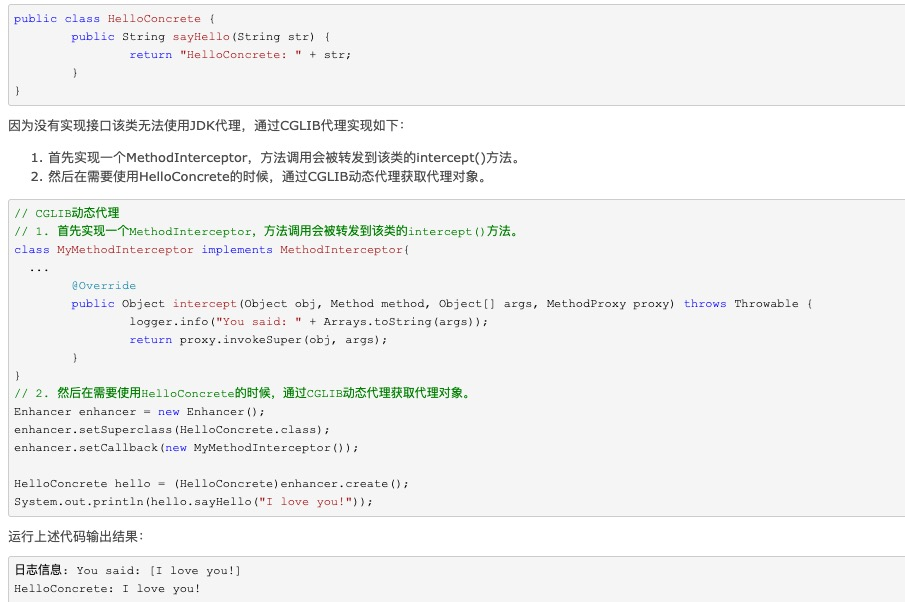

# CGLib


- 上述代码中，我们通过CGLIB的Enhancer来指定要代理的目标对象、实际处理代理逻辑的对象，最终通过调用create()方法得到代理对象，对这个对象所有非final方法的调用都会转发给MethodInterceptor.intercept()方法，在intercept()方法里我们可以加入任何逻辑，比如修改方法参数，加入日志功能、安全检查功能等；通过调用MethodProxy.invokeSuper()方法，我们将调用转发给原始对象，具体到本例，就是HelloConcrete的具体方法。CGLIG中MethodInterceptor的作用跟JDK代理中的InvocationHandler很类似，都是方法调用的中转站。

- final 方法和final 类无法代理，主要原因是cglib通过继承实现的。

- 实际上是final重载了这个方法，然后获取了传进来的MethodInteceptor，调用这个intercept方法，如果MethodInteceptor对象为空，直接调用父类方法。

# JDK反射代理
```java
package org.java.base.springaop;
import java.lang.reflect.InvocationHandler;
import java.lang.reflect.Method;
public class MyInvocationHandler implements InvocationHandler {
 private Object target;
 /**
 * 构造函数
 * @param target
 */
 MyInvocationHandler(Object target) {
 super();
 this.target = target;
 }
 public Object invoke(Object proxy, Method method, Object[] args)
 throws Throwable {
 // 程序执行前加入逻辑，MethodBeforeAdviceInterceptor
 System.out.println("before-----------------------------");
 // 程序执行
 Object result = method.invoke(target, args);
 // 程序执行后加入逻辑，MethodAfterAdviceInterceptor
 System.out.println("after------------------------------");
 return result;
 }
}
-----------------使用Proxy代理，

import java.lang.reflect.Proxy;
public class Test {
 public static void main(String[] args) {
 Service aService = new ServiceImpl();
 MyInvocationHandler handler = new MyInvocationHandler(aService);
 // Proxy为InvocationHandler实现类动态创建一个符合某一接口的代理实例
 Service aServiceProxy = (Service) Proxy.newProxyInstance(aService.getClass().getClassLoader(), aService.getClass().getInterfaces(), handler);
 // 由动态生成的代理对象来aServiceProxy 代理执行程序，其中aServiceProxy 符合Service接口
 aServiceProxy.add();
 System.out.println();
 aServiceProxy.update();
 }
}
```