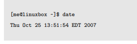
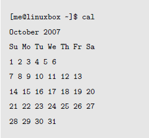

# 基本知识

- 如果提示符的最后一个字符是“#”, 而不是“$”, 那么这个终端会话就有超级用户权限。
- Linux 发行版默认保存最后输入的 500 个命令
- date命令显示日期

- cal显示当前月份的日历

- df 查看磁盘剩余空间
- free 查看空闲内存数
- 终端会话都可以通过按下Ctrl-Alt-F1 到Ctrl-Alt-F6
访问。返回图形桌面，按下Alt-F7。
- Linux大小写敏感（win不敏感）
- 可以用" "代替空格