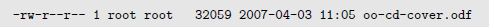

## cd
- cd - 更改工作目录到先前的工作目录。
- cd ˜user_name 更改工作目录到用户家目录。例如, cd ˜bob 会更改工作目
录到用户“bob”的家目录。
## ls
- ls /usr ~ 可以同时显示多个文件夹

| 选项  | 长选项 | 描述 |
|-------|--------|------|
|-a | --all | 列出所有文件，甚至包括文件名以圆点开头的默认会被隐藏的隐藏文件。|
|-d | --directory | 通常，如果指定了目录名，ls 命令会列出这个目录中的内容，而不是目录本身。把这个选项与-l 选项结合使用，可以看到所指定目录的详细信息，而不是目录中的内容。|
|-F | --classify | 这个选项会在每个所列出的名字后面加上一个指示符。例如，如果名字是目录名，则会加上一个’/’ 字符。|
|-h | --human-readable | 当以长格式列出时，以人们可读的格式，而不是以字节数来显示文件的大小。|
|-l |  | 以长格式显示结果。|
|-r | --reverse | 以相反的顺序来显示结果。通常，ls 命令的输出结果按照字母升序排列。|
|-S | | 命令输出结果按照文件大小来排序。|
|-t | | 按照修改时间来排序。|

- -l详解

字段 | 含义
------- | -
-rw-r--r-- | 对于文件的访问权限。第一个字符指明文件类型。在不同类型之间，开头的“－”说明是一个普通文件，“d”表明是一个目录。其后三个字符是文件所有者的访问权限，再其后的三个字符是文件所属组中成员的访问权限，最后三个字符是其他所有人的访问权限。这个字段的完整含义将在第十章讨论。
1  | 文件的硬链接数目。参考随后讨论的关于链接的内容。
root | 文件所有者的用户名。
root  | 文件所属用户组的名字。
32059 | 以字节数表示的文件大小。
2007-04-03 11:05 | 上次修改文件的时间和日期。
oo-cd-cover.odf  | 文件名。

## file
- file picture.jpg 输出：picture.jpg: JPEG image data, JFIF standard 1.01

## less
- less filename 进入less模式，显示一页，每次向后翻页
- Page UP or b 向上翻滚一页
- Page Down or space 向下翻滚一页
- UP Arrow 向上翻滚一行
- Down Arrow 向下翻滚一行
- G 移动到最后一行
- 1G or g 移动到开头一行
- /charaters 向前查找指定的字符串
- n 向前查找下一个出现的字符串，这个字符串是之前所指定查找的
- h 显示帮助屏幕
- q 退出less 程序

## more
与less类似但是只能向前翻页