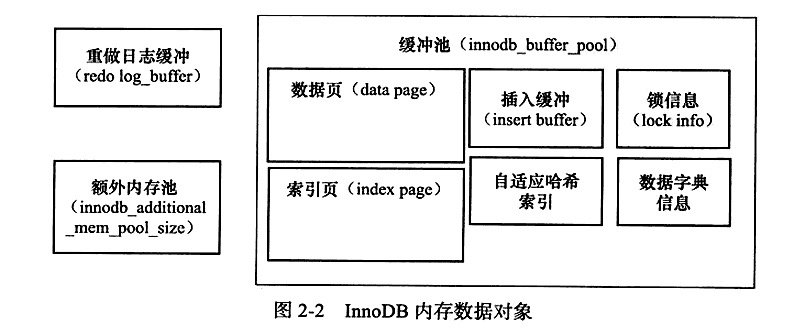

# InnoDB
/usr/local/mysql/data

- 支持事务，
- 行锁设计，
- 支持外键。
- 用了MVCC（多版本并发控制）实现了四种隔离级别。使用next-key locking避免幻读。
- 1.2开始支持全文索引（mysql5.6）
## Thread
### Master Thread
主要负责缓冲池中的数据的异步刷新到磁盘，保证数据一致性
### IO Thread
- 大量使用AIO（Async IO）
- 1.0前有四个(write\read\insert buffer\log)，现在write\read\分别增大到了4个
### Purge Thread
回收undolog，1.1之前由master thread完成，之后由该线程完成。

### 内存
- 页式存储
- inodb_buffer_pool_size设置缓冲区大小
- 
- 使用LRU置换算法，新页插入到尾端37%处
- LRU队列从free队列中取
- 还有redo log buffer
- checkpoint技术：sharp checkpoint将脏页全部刷新回磁盘（数据库关闭时）；fuzzy checkpoint，运行时只刷新一部分。
### 关键特性
1. 插入缓冲 
- Insert buffer 插入的非聚集索引页，在缓冲池则直接插入；否则先放在Insert Buffer对象中。然后再以一定频率和辅助索引页子节点合并。（第一索引不是唯一，第二索引是辅助索引）
- change buffer： delete buffer 标记删除记录，purge buffer真正删除
- Insert Buffer 是B+树
2. 两次写
- 一部分doublewrite buffer 大小2MB，另一部分物理磁盘上共享表空间中连续的128个页（两个区，也是2MB）
- 先将脏页复制到buffer，然后分两次，一次写1MB到共享表空间中，然后马上调用fsync函数同步磁盘。再将buffer中的页写到各个表空间文件中。
3. 自适应哈希索引（AHI）
如果建立哈希索引能提升速度，则建立哈希索引。
- 连续访问模式一样，以该模式访问了100次，且也通过该模式访问了N次（N=页中记录/16）
4. 异步IO 1.1以后使用内核实现
5. 刷新邻接页 （刷新邻接脏页）
# MyISAM
- 不支持事务、表锁，
- 支持全文索引，
- 缓冲池只缓存索引文件
- 由MYD和MYI组成，前者放数据，后者放索引。
- 5.0之前进支持4GB表，5.0开始默认256TB

# 连接方式
- TCP/IP套字节 mysql -hIPaddress -u username -p (需要回车输入密码)
- UNIX套字节 mysql -uusername -S /tmp/mysql.sock