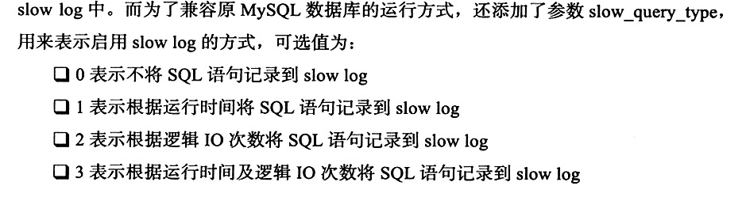

## 错误日志
## 慢查询日志
设置 long_query_time=n，设置 long_slow_queries为开启。
当长训时间大于n时，记录下来。

mysqldumpslow -s al -n 10 david.log; 输出执行时间最长的10条sqk

## 查询日志
默认文件名 主机名.log
记录了所有对MySQl数据库请求的信息

## 二进制日志
执行更改的所有操作，但是不包括SELECT 和 SHOW（没有对数据做更改）